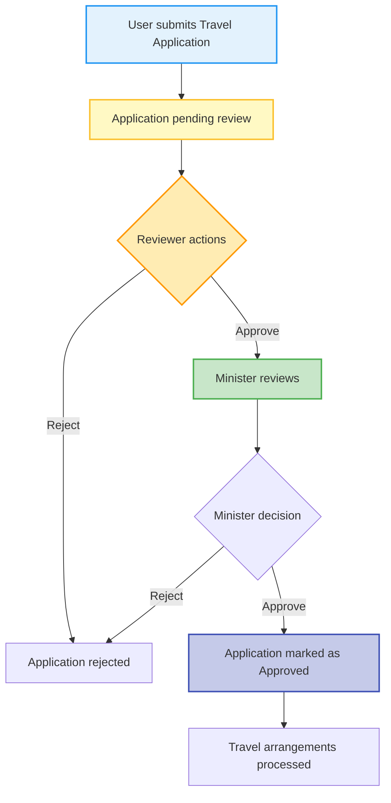

# Travel Application Stack – Admin Guide

## Overview
This application enables users to submit travel requests, which are then reviewed and approved through a multi‑stage workflow. It is built with a **Node.js/Express** backend and a **React** frontend, both written in **TypeScript**, and uses **PostgreSQL** for data storage. The system also supports LDAP authentication.

## Business Flow Process

## Email Notifications
- **Submission** – Applicant receives a confirmation email when the application is submitted.
- **Reviewer Assignment** – Reviewer receives an email when a new application is pending review.
- **Reviewer Decision** – Applicant receives an email when the reviewer approves or rejects.
- **Minister Assignment** – Minister receives an email when the reviewer forwards the application.
- **Minister Decision** – Applicant receives an email when the minister approves or rejects.
- **Final Approval** – Applicant receives an email when the application is fully approved and travel arrangements are processed.

## User Profiles & Access Rights
| Role | Description | Access Level |
|------|-------------|--------------|
| **Admin** | Manages system settings, department profiles, and can view all applications. | Full access to admin panel, settings, and all data. |
| **Reviewer** | Reviews submitted applications, can approve to forward to Minister. | View and edit applications in *Submitted* state, add comments, upload attachments. |
| **Minister** | Final approver for applications that passed reviewer stage. | View applications awaiting minister approval, approve or reject. |
| **Applicant (User)** | Submits travel applications and tracks their own request status. | Create, edit, and view own applications; upload required documents. |

## Technology Stack
- **Backend**: Node.js (v20) with Express, written in **TypeScript**. Uses `pg` for PostgreSQL interaction and `ldapjs` for LDAP authentication.
- **Frontend**: React (Vite) with **TypeScript** and vanilla CSS for styling. UI components follow a modern, responsive design.
- **Database**: PostgreSQL, schema defined in `backend/src/services/database.ts`.
- **Containerisation**: Docker Compose orchestrates the backend, frontend, PostgreSQL, Redis, and Mailpit services.
- **Authentication**: Supports local password authentication and optional LDAP integration.

## Quick Start for Admins

### Initial Setup
1. **Install dependencies**: Run `./install.sh`
2. **Configure environment**: Run `./setup-config.sh docker`
3. **Start services**: Run `docker compose up -d`
4. **Access application**: Navigate to `http://localhost:8090`
5. **Login**: Use default test credentials (see [DEVELOPMENT_CREDENTIALS.md](./DEVELOPMENT_CREDENTIALS.md))

### Configuration
- Use the **Settings** tab to configure LDAP, email, and upload settings
- Manage departments via **Department Profiles** in the admin UI
- See [.env.example](./.env.example) for all configuration options

---

## Documentation

### For Development
- **[INSTALL.md](./INSTALL.md)** - Installation instructions
- **[DEVELOPMENT.md](./DEVELOPMENT.md)** - Local development setup
- **[DEVELOPMENT_CREDENTIALS.md](./DEVELOPMENT_CREDENTIALS.md)** - Default test account credentials ⚠️

### For Deployment
- **[DEPLOYMENT.md](./DEPLOYMENT.md)** - Configuration for different environments (dev/docker/prod)
- **[PRODUCTION_DEPLOYMENT.md](./PRODUCTION_DEPLOYMENT.md)** - Safe production deployment process
- **[GIT_WORKFLOW.md](./GIT_WORKFLOW.md)** - Git branching strategy and release process
- **[CHANGELOG.md](./CHANGELOG.md)** - Release history and version tracking

### For Administration
- **[PRODUCTION.md](./PRODUCTION.md)** - Production deployment guide
- **[ADMIN_SETTINGS_REVIEW.md](./ADMIN_SETTINGS_REVIEW.md)** - Admin settings documentation
- **[DATABASE_MIGRATION.md](./DATABASE_MIGRATION.md)** - Database migration procedures

---

## Default Development Credentials

⚠️ **For Development Only - Delete Before Production!**

| User | Email | Password | Role |
|------|-------|----------|------|
| Admin | `admin@example.com` | `Admin123!` | ADMIN, REVIEWER |
| Reviewer | `reviewer@example.com` | `Review123!` | REVIEWER |
| User | `user@example.com` | `User123!` | USER |

See [DEVELOPMENT_CREDENTIALS.md](./DEVELOPMENT_CREDENTIALS.md) for more details and production checklist.

---

## Technology Stack
- **Backend**: Node.js (v20) with Express, written in **TypeScript**. Uses `pg` for PostgreSQL interaction and `ldapjs` for LDAP authentication.
- **Frontend**: React (Vite) with **TypeScript** and vanilla CSS for styling. UI components follow a modern, responsive design.
- **Database**: PostgreSQL, schema defined in `backend/src/services/database.ts`.
- **Containerisation**: Docker Compose orchestrates the backend, frontend, PostgreSQL, Redis, and Mailpit services.
- **Authentication**: Supports local password authentication and optional LDAP integration.

---

*For support or questions, refer to the appropriate documentation file above.*
